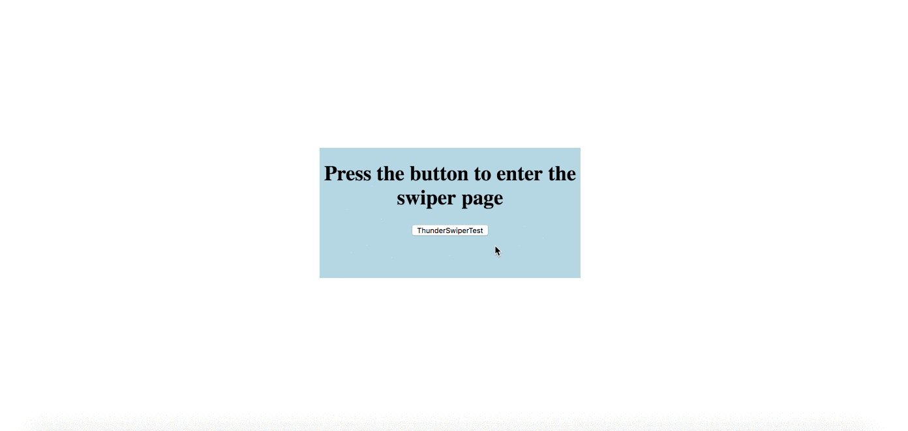
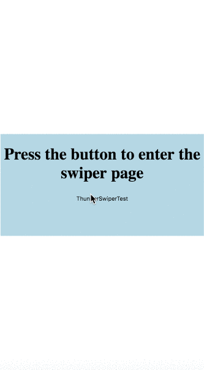

# Thunder Swiper

## Feature
1. swipe the JS element in your page
2. button click, mouse event and touch event are supported (web and wap)
3. flexible

## How to use

1. import the react components you want to swipe on your page into ComponentList.js file
    >import Page1 from '../Example/Page1';         
    import Page2 from '../Example/Page2';          
    import Page3 from '../Example/Page3';          
 
    >export {                                      
        Page1 as Component1,                       
        Page2 as Component2,                       
        Page3 as Component3                        
    }                                               
2. import ThunderSwiper.js and use it in the parent component.
    ><ThunderSwiper                                
        isOpenSwiper={isOpen}                      
        isCloseSwiper={this.switchButtonClose}     
        swipePageTotalNumber={3}                   
        swiperType={'navigation'}                  
        />                                         

## Example
1. Navigation Swiper
    
2. Web Horizontal Swiper
    
3. Web Vertical Swiper
    
4. Wap Horizontal Swiper
    
5. Wap vertical Swiper
    

